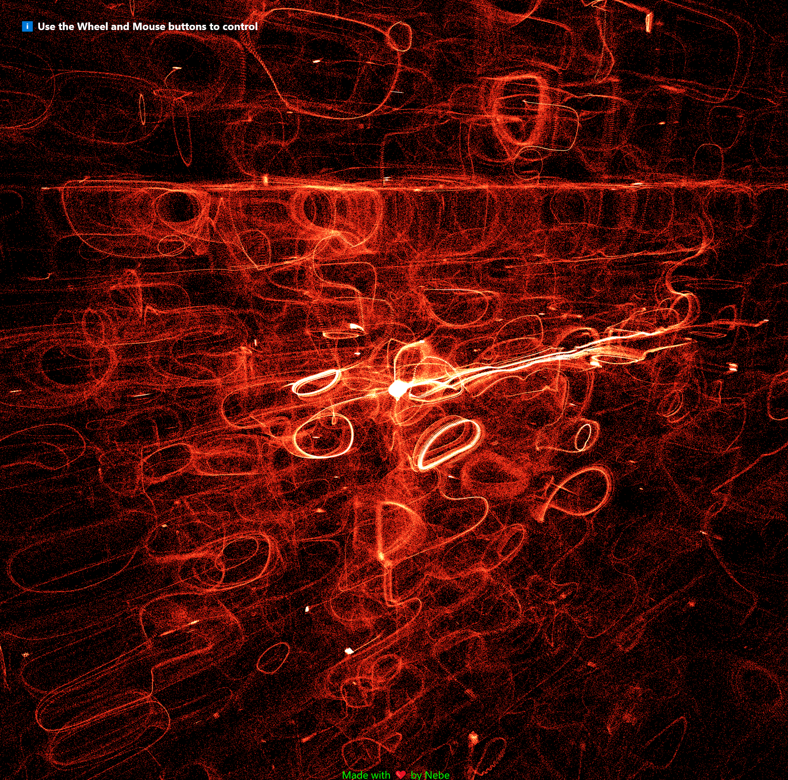

# Black Hole Particle Simulation 



This project is a WebGL-based simulation of particle behavior around a black hole, created using Three.js and GLSL shaders. It demonstrates complex particle systems, GPU-based computations, and advanced rendering techniques.

## Features

- Real-time simulation of thousands of particles
- GPU-accelerated computations using Three.js GPUComputationRenderer
- Custom GLSL shaders for particle behavior and rendering
- Customizable simulation parameters
- Interactive camera controls

## Technologies Used

- [Three.js](https://threejs.org/): A powerful 3D graphics library for WebGL
- [WebGL](https://www.khronos.org/webgl/): Web Graphics Library for rendering interactive 2D and 3D graphics
- [GLSL](https://www.khronos.org/opengl/wiki/Core_Language_(GLSL)): OpenGL Shading Language for custom shaders
- [Webpack](https://webpack.js.org/): Module bundler for managing dependencies and building the project
- [Babel](https://babeljs.io/): JavaScript compiler for using next generation JavaScript

## Prerequisites

Before you begin, ensure you have met the following requirements:

- You have installed the latest version of [Node.js and npm](https://nodejs.org/)
- You have a Windows/Linux/Mac machine with a modern web browser that supports WebGL

## Installing Black Hole Particle Simulation

To install the project, follow these steps:

1. Clone the repository:
   ```
   git clone https://github.com/your-username/black-hole-particle-simulation.git
   ```

2. Navigate to the project directory:
   ```
   cd black-hole-particle-simulation
   ```

3. Install the dependencies:
   ```
   npm install
   ```

## Using Black Hole Particle Simulation

To use the simulation, follow these steps:

1. Start the development server:
   ```
   npm run start
   ```

2. Open your web browser and navigate to `http://localhost:9000` (or the port specified in your webpack configuration).

3. You should now see the particle simulation running in your browser. You can interact with the simulation using your mouse to rotate and zoom the camera.

## Customizing the Simulation

You can customize various aspects of the simulation by modifying the constants at the top of the `src/index.js` file. These include:

- `TEXTURE_SIZE`: Determines the number of particles (TEXTURE_SIZE^2)
- `CAMERA_FOV`, `CAMERA_NEAR`, `CAMERA_FAR`: Camera settings
- `POINT_SIZE`, `PARTICLE_COLOR`: Particle appearance
- `CENTER_MASS`, `PARTICLE_MASS`, `VELOCITY_TERMINAL`: Physics parameters
- `CURL_RADIUS`, `CURL_FORCE_FACTOR`, `PULL_FORCE_FACTOR`: Force field parameters
- `INITIAL_RADIUS_FACTOR`, `INITIAL_RADIUS_EXPONENT`: Initial particle distribution

After modifying these values, restart the development server to see the changes.
